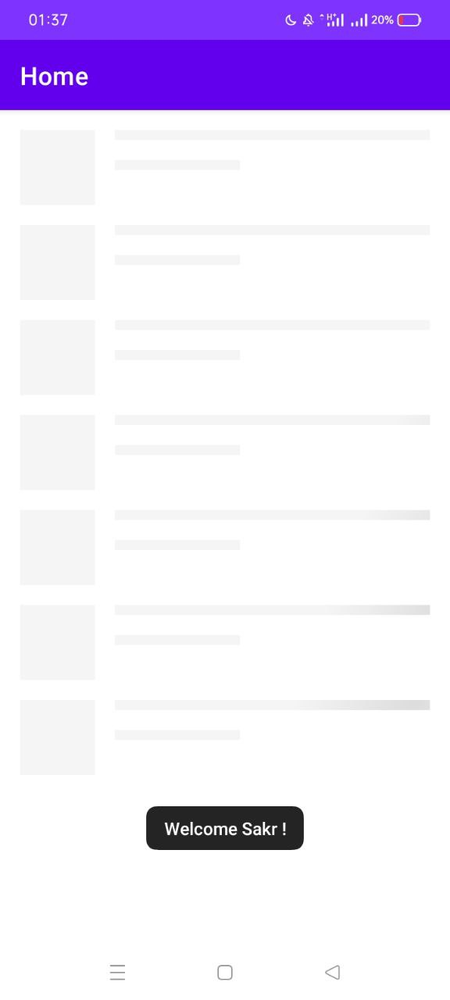
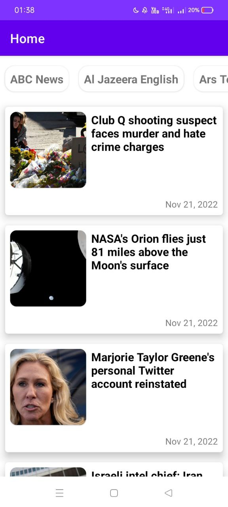
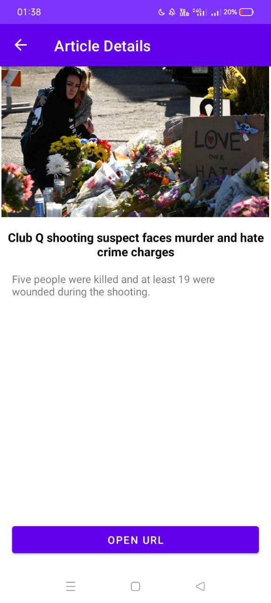
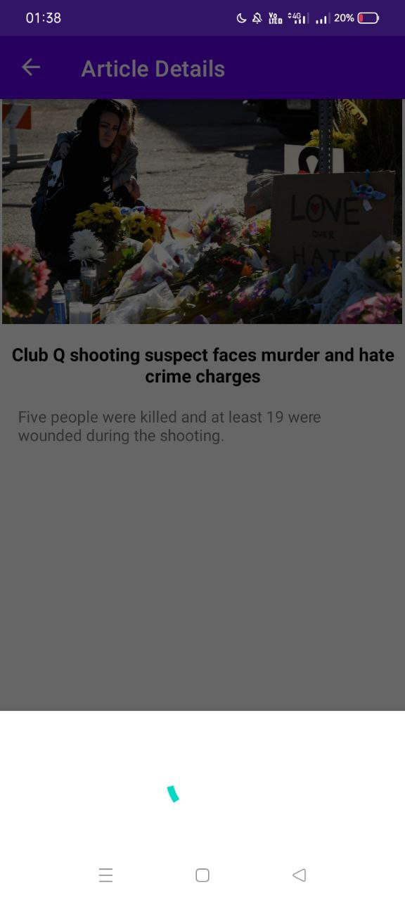

# Assignment-Android-Developer
Hyper-One Assignment 

### Overview :
Built using Kotlin and implementing MVVM architecture.

Note : Some sources doesn't containt data with free api key , so please feel free to try another source if you don't get data

### Screenshots :
 <table align="center">
  <tr>
    <td></td>
    <td></td>
    <td></td>
    <td></td>
  </tr>
    <tr>
    <td></td>
    <td></td>
    <td></td>
  </tr>
  

   
</table>  

### Tools and Tech stack used : 

 * Kotlin
 * XML
 * MVVM Architecture
 * Room database library
 * Android Studio
 * Third party libraries like [retrofit](https://square.github.io/retrofit/), [glide](https://github.com/bumptech/glide), [shimmer](https://github.com/facebook/shimmer-android).
